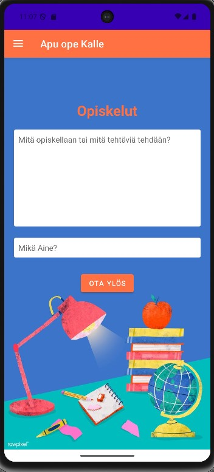

lopumty-(Lopputyö)

Nimi:

Ryhmä:TA42T23K

Muistiinpano/Opiskelumuistio – Android-sovellus opiskelijalle

Sovelluksen kuvaus

Opiskelumuistio on Android-sovellus, jonka avulla opiskelija voi tehdä, tallentaa ja hallita omia muistiinpanojaan ja tehtäviään. Sovellus on suunniteltu helpottamaan opiskelun organisointia ja muistettavien asioiden hallintaa.

Sovellus on kehitetty Android Studiolla osana Projekti: Tekoäly/Mobiili - T42T187OJ-3003 kurssia.


Käyttöohjeet

1. Avaa sovellus – se luo automaattisesti tarvittavat tiedostot ja tietokannan.
2. Etusivulla voit lisätä uusia merkintöjä (aine + tehtävä).
3. Valitse valikko vasemmasta yläkulmasta ja siirry:
   - "Tietojenkatselu" nähdäksesi yhteenvedon,
   - "Tietojen tyhjennys" poistaaksesi yksittäisiä tai kaikki merkinnät.
4. Sovellus näyttää muistiinpanot tiivistetysti aineen mukaan.
5. Halutessasi voit poistaa koko tietokannan yhdellä painikkeella.


Rakenne

Sovelluksessa on kolme pääfragmenttia:

- HomeFragment(Etusivu): Muistiinpanojen lisäämiselle
- ViewFragment(Tietojenkatselu): Muistiinpanojen tarkasteluun
- EditFragment(Tietojen tyhennys): Muistiinpajonen poistamiseen

Ominaisuudet

-  Muistiinpanojen lisääminen  
  Käyttäjä voi syöttää aiheen ja tehtävän kuvauksen, jotka tallennetaan sovelluksen paikalliseen tietokantaan.

-  Muistiinpanojen katselu  
  Näyttää tallennetut muistiinpanot ryhmiteltynä aiheen perusteella. Sovellus näyttää myös, kuinka monta tehtävää kuhunkin aiheeseen liittyy.

-  Muistiinpanojen poistaminen  
  Käyttäjä voi poistaa yksittäisen muistiinpanon tai kaikki kerralla.

-  Navigointi
  Käyttöliittymässä on vasemmasta yläkulmasta avautuva valikko, josta pääsee eri näkymiin: Etusivu, katsele ja tyhjennys.

Tekninen toteutus

- IDE: Android Studio Meerkat Feature Drop | 2024.3.2  
- Kieli: Kotlin (Java 17.0.15 -yhteensopiva) 
- Arkkitehtuuri: MVVM (Model-View-ViewModel)  
- Tietokanta: Room (Jetpack)  
- Datankeruu: LiveData + DAO  
- Minimi API-taso: 26 (Android 8.0)
- Käyttöliittymä: XML-pohjainen layout-rakenne (fragmentit, napit, valikot)

Asennusohjeet

1. Kloonaa projekti koneellesi githubista:
    ```bash
   git clone <https://github.com/M3nska/lopumty->

2. Avaa projekti Android Studiossa:
File > Open > valitse projektikansio

3.Käännä ja suorita:
Varmista, että käytössäsi on emulaattori tai Android-laite, jossa on API 26 (Android 8.0) tai uudempi.
Klikkaa run ja sovellus hoitaa kaiken muun mitä se tarvitsee

Päivitys: Ryhmitelty näkymä ja uusipainike 1.2 (vitsi että olisi parempi)
Uudessa päivityksessä on muokattu ViewFragmenttia joten nyt se tiivistää ja näyttää käyttäjälle, kunka paljon hänellä on
tehtävää yhdestä aineesta esim:
Matematiikka: 3 tehtävää
Fysiikka: 1 tehtävä
Tietotekniikka 6 tehtävää
Tämä on toteutettu käyttäen groupinBy ja LiveData kotlinissa ja tämä saa aikaan sen että on helpompi hahmottaa
paljon on tehtävää jäljellä per aine.

Uusipainike EditFragmentissa, jonka avulla voidaan poistaa kaikki data, jolloin käyttäjän ei tarvitse yksi kerrallaan poistaa dataa.


